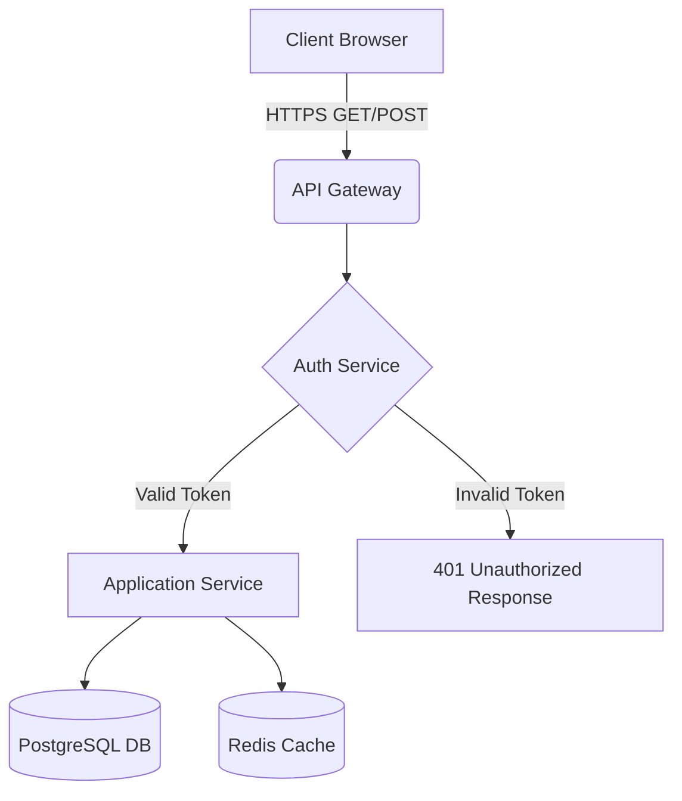
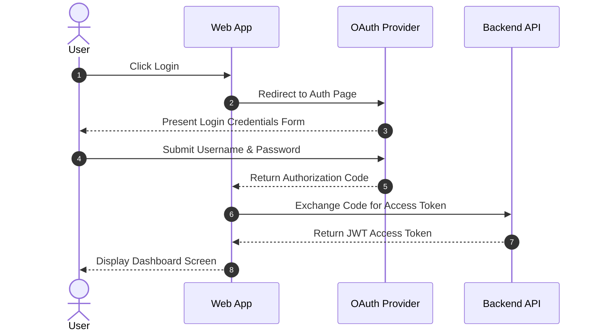
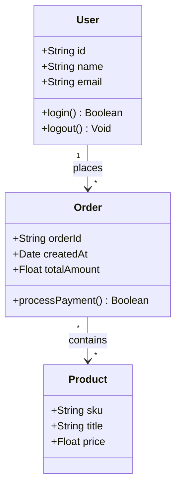
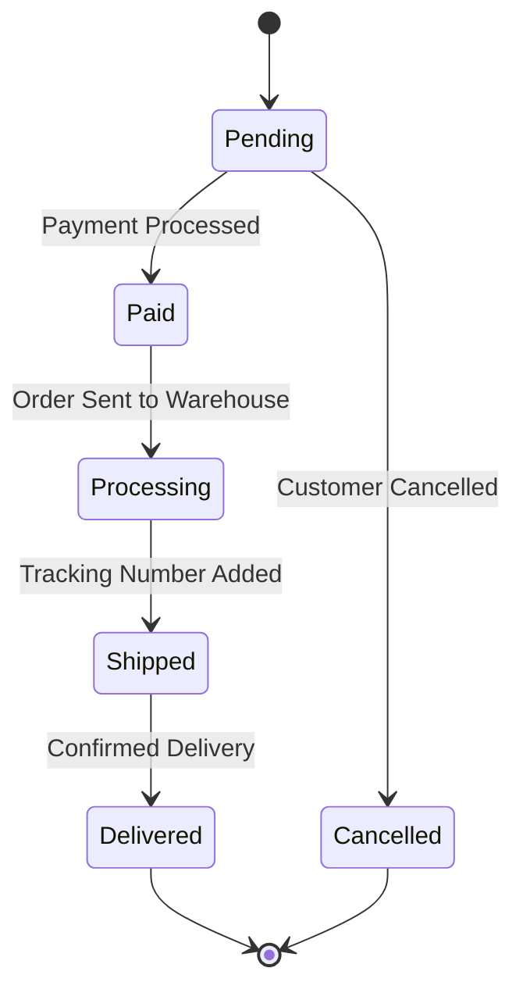
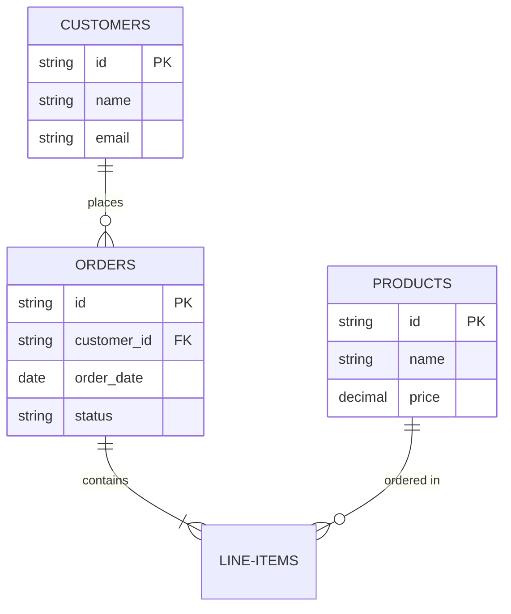
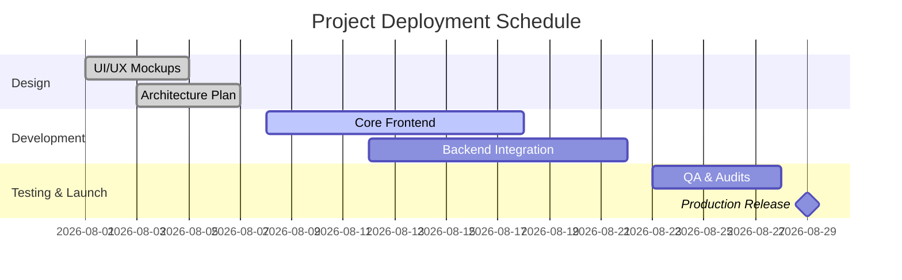
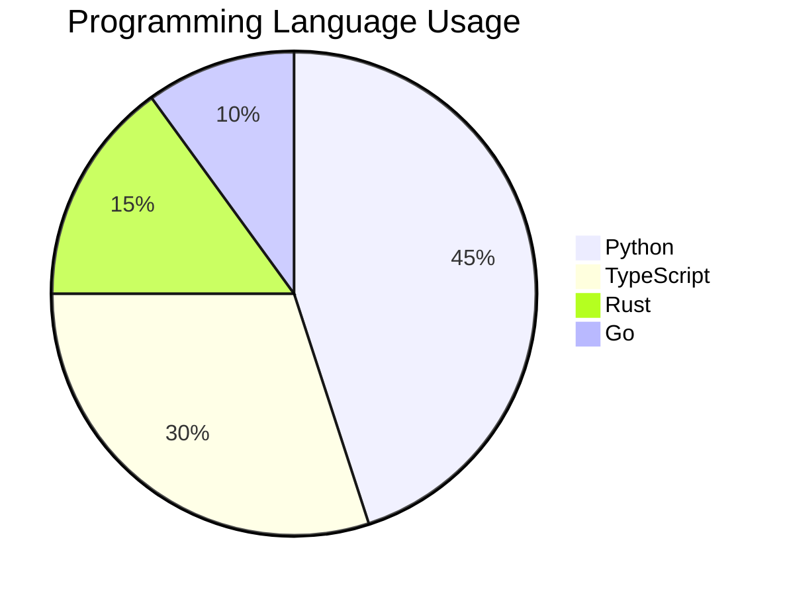
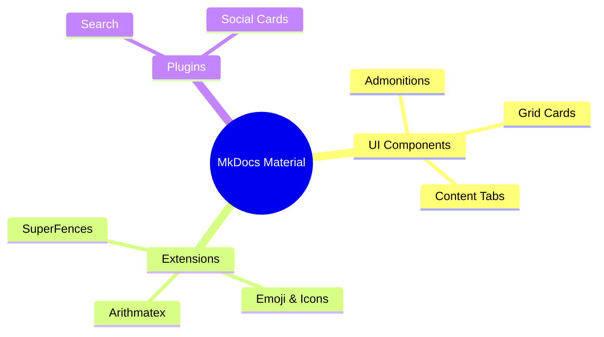

# Diagrams & Media Showcase

This page demonstrates **Mermaid.js diagramming integration** (`pymdownx.superfences`), Material Icon sets, and media handling capabilities in Material for MkDocs.

---

## 1. Mermaid.js Live Diagrams

Mermaid diagrams render directly in the browser as interactive vector SVGs.

### Flowchart — System Architecture



??? note "View Source Markdown for Flowchart"

    ````markdown
    ```mermaid
    graph TD
        A[Client Browser] -->|HTTPS GET/POST| B(API Gateway)
        B --> C{Auth Service}
        C -->|Valid Token| D[Application Service]
        C -->|Invalid Token| E[401 Unauthorized Response]
        D --> F[(PostgreSQL DB)]
        D --> G[(Redis Cache)]
    ```
    ````

---

### Sequence Diagram — User Authentication Flow



??? note "View Source Markdown for Sequence Diagram"

    ````markdown
    ```mermaid
    sequenceDiagram
        autonumber
        actor User
        participant Client as Web App
        participant Auth as OAuth Provider
        participant API as Backend API

        User->>Client: Click Login
        Client->>Auth: Redirect to Auth Page
        Auth-->>User: Present Login Credentials Form
        User->>Auth: Submit Username & Password
        Auth-->>Client: Return Authorization Code
        Client->>API: Exchange Code for Access Token
        API-->>Client: Return JWT Access Token
        Client-->>User: Display Dashboard Screen
    ```
    ````

---

### Class Diagram — Object Model Design



??? note "View Source Markdown for Class Diagram"

    ````markdown
    ```mermaid
    classDiagram
        class User {
            +String id
            +String name
            +String email
            +login() Boolean
            +logout() Void
        }

        class Order {
            +String orderId
            +Date createdAt
            +Float totalAmount
            +processPayment() Boolean
        }

        class Product {
            +String sku
            +String title
            +Float price
        }

        User "1" --> "*" Order : places
        Order "*" --> "*" Product : contains
    ```
    ````

---

### State Diagram — Order Lifecycle



??? note "View Source Markdown for State Diagram"

    ````markdown
    ```mermaid
    stateDiagram-v2
        [*] --> Pending
        Pending --> Paid: Payment Processed
        Pending --> Cancelled: Customer Cancelled
        Paid --> Processing: Order Sent to Warehouse
        Processing --> Shipped: Tracking Number Added
        Shipped --> Delivered: Confirmed Delivery
        Delivered --> [*]
        Cancelled --> [*]
    ```
    ````

---

### Entity Relationship (ER) Diagram — Database Schema



??? note "View Source Markdown for ER Diagram"

    ````markdown
    ```mermaid
    erDiagram
        CUSTOMERS ||--o{ ORDERS : places
        ORDERS ||--|{ LINE-ITEMS : contains
        PRODUCTS ||--o{ LINE-ITEMS : "ordered in"

        CUSTOMERS {
            string id PK
            string name
            string email
        }
        ORDERS {
            string id PK
            string customer_id FK
            date order_date
            string status
        }
        PRODUCTS {
            string id PK
            string name
            decimal price
        }
    ```
    ````

---

### Gantt Chart — Project Timeline



??? note "View Source Markdown for Gantt Chart"

    ````markdown
    ```mermaid
    gantt
        dateFormat  YYYY-MM-DD
        title Project Deployment Schedule
        section Design
        UI/UX Mockups       :done,    des1, 2026-08-01, 2026-08-05
        Architecture Plan   :done,    des2, 2026-08-03, 2026-08-07
        section Development
        Core Frontend       :active,  dev1, 2026-08-08, 2026-08-18
        Backend Integration :         dev2, 2026-08-12, 2026-08-22
        section Testing & Launch
        QA & Audits         :         test1, 2026-08-23, 2026-08-28
        Production Release  :milestone, m1, 2026-08-29, 0d
    ```
    ````

---

### Mindmap & Pie Chart





??? note "View Source Markdown for Pie Chart & Mindmap"

    ````markdown
    ```mermaid
    pie title Programming Language Usage
        "Python" : 45
        "TypeScript" : 30
        "Rust" : 15
        "Go" : 10
    ```

    ```mermaid
    mindmap
      root((MkDocs Material))
        UI Components
          Admonitions
          Grid Cards
          Content Tabs
        Extensions
          SuperFences
          Arithmatex
          Emoji & Icons
        Plugins
          Search
          Social Cards
    ```
    ````

---

## 2. PyMdown Emoji & Material Icons

Material for MkDocs embeds thousands of icons from **Material Design Icons**, **FontAwesome**, and **GitHub Octicons** directly as SVG elements.

### Icon Sets Overview

| Collection | Sample Icons | Syntax |
| :--- | :--- | :--- |
| **Material Design** | :material-rocket-launch: :material-shield-check: :material-lightning-bolt: :material-folder-multiple: | `:material-rocket-launch:` |
| **FontAwesome** | :fontawesome-brands-github: :fontawesome-brands-docker: :fontawesome-brands-python: :fontawesome-brands-react: | `:fontawesome-brands-github:` |
| **Octicons** | :octicons-git-commit-16: :octicons-git-pull-request-16: :octicons-star-16: :octicons-repo-16: | `:octicons-git-commit-16:` |
| **Emojis** | :smile: :rocket: :fire: :sparkles: :checkered_flag: | `:rocket:` |

??? note "View Source Markdown for Icon Sets"

    ```markdown
    | Collection | Sample Icons | Syntax |
    | :--- | :--- | :--- |
    | **Material Design** | :material-rocket-launch: :material-shield-check: :material-lightning-bolt: :material-folder-multiple: | `:material-rocket-launch:` |
    | **FontAwesome** | :fontawesome-brands-github: :fontawesome-brands-docker: :fontawesome-brands-python: :fontawesome-brands-react: | `:fontawesome-brands-github:` |
    | **Octicons** | :octicons-git-commit-16: :octicons-git-pull-request-16: :octicons-star-16: :octicons-repo-16: | `:octicons-git-commit-16:` |
    | **Emojis** | :smile: :rocket: :fire: :sparkles: :checkered_flag: | `:rocket:` |
    ```
